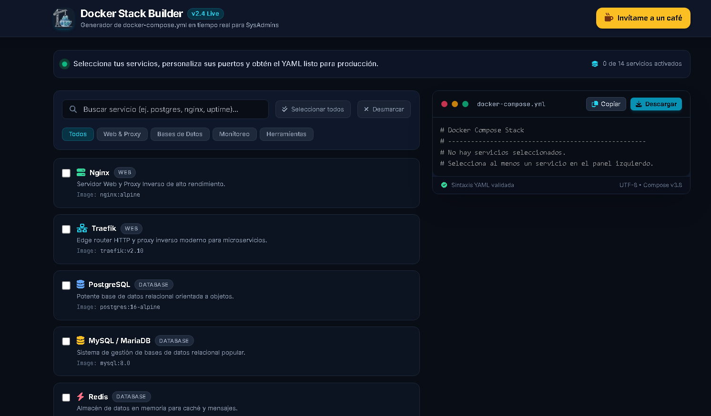

[](https://buymeacoffee.com/izxnmartini)
# 🐳 Docker Stack Builder

> A clean, fast, and visual web tool to generate real-time `docker-compose.yml` configurations for your self-hosted stacks and dev environments.

[](https://docker-stack-builder.vercel.app/)
[](https://opensource.org/licenses/MIT)

---



---

## 🚀 Live Demo

Try the app directly in your browser:  
👉 **[docker-stack-builder.vercel.app](https://docker-stack-builder.vercel.app/)**

---

## ✨ Features

- 🧩 **Visual Service Selection:** Pick pre-configured services categorized by Web/Proxy, Databases, Monitoring, and Tools (Nginx, Traefik, PostgreSQL, Redis, MongoDB, etc.).
- ⚡ **Real-Time YAML Generation:** Watch your `docker-compose.yml` update instantly as you select options.
- 📋 **1-Click Export:** Copy the generated YAML directly to your clipboard or download it as a `.yml` file.
- 🔒 **Zero Friction:** 100% free, no registration or login required.

---

## 🛠️ Tech Stack

- **Framework:** Next.js / React
- **Styling:** Tailwind CSS
- **Deployment:** Vercel

---

## 💻 Local Development

To run this project locally on your machine:

```bash
# Clone the repository
git clone [https://github.com/izxnmartinez-eng/docker-stack-builder.git](https://github.com/izxnmartinez-eng/docker-stack-builder.git)

# Navigate to project folder
cd docker-stack-builder

# Install dependencies
npm install

# Run development server
npm run dev
